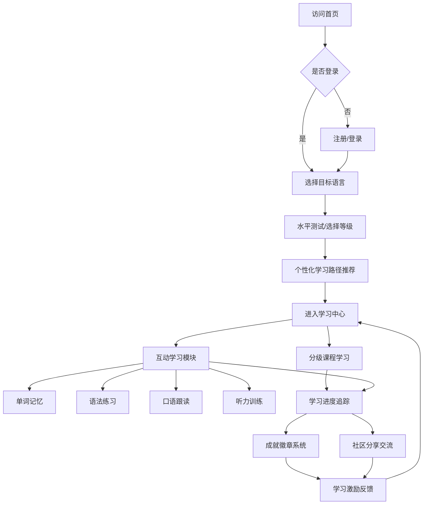

## 1. 产品概述

LinguaVerse 是一款沉浸式多语种在线学习平台，支持英语、日语、韩语等主流语言的系统学习。平台通过分级课程体系和丰富的互动学习模块，为用户打造个性化的语言学习体验，配合社区交流和成就激励系统，持续激发学习动力。

- 核心目标：让语言学习变得高效、有趣、沉浸式
- 目标用户：学生、职场人士、语言爱好者等各年龄段学习者
- 产品价值：一站式多语种学习解决方案，科学分级 + 互动练习 + 社区激励

## 2. 核心功能

### 2.1 用户角色
| 角色 | 注册方式 | 核心权限 |
|------|----------|----------|
| 普通用户 | 邮箱/用户名注册 | 浏览课程、学习互动、社区交流、查看进度 |
| 访客 | 无需注册 | 浏览首页和课程介绍 |

### 2.2 功能模块
1. **首页**：英雄区、语言选择、特色功能介绍、学习数据展示
2. **课程中心**：分级课程列表、课程详情、章节学习
3. **互动学习**：单词记忆、语法练习、口语跟读、听力训练
4. **学习中心**：进度追踪、学习统计、个人成就
5. **社区广场**：动态发布、评论互动、排行榜
6. **用户中心**：注册登录、个人信息、学习路径推荐

### 2.3 页面详情
| 页面名称 | 模块名称 | 功能描述 |
|----------|----------|----------|
| 首页 | 英雄区 | 多语言切换展示、Slogan、立即开始CTA |
| 首页 | 语言选择 | 英语/日语/韩语卡片切换，展示课程概览 |
| 首页 | 功能特色 | 四大学习模块介绍卡片 |
| 首页 | 数据展示 | 平台学习数据、用户评价 |
| 课程中心 | 分级课程 | 初级/中级/高级课程列表，按难度筛选 |
| 课程中心 | 课程详情 | 课程介绍、章节列表、学习进度 |
| 单词学习 | 单词卡片 | 翻转卡片记忆，支持发音、例句 |
| 单词学习 | 测试模式 | 选择题、拼写题巩固记忆 |
| 语法练习 | 练习题 | 填空、选择、改错多种题型 |
| 语法练习 | 解析说明 | 错题解析、语法知识点讲解 |
| 口语跟读 | 句子跟读 | 原音播放、录音对比、评分反馈 |
| 听力训练 | 听力材料 | 对话、短文、新闻等多种素材 |
| 听力训练 | 答题模式 | 听音选图、听写、理解题 |
| 学习中心 | 进度仪表盘 | 总体进度、每日学习时长、连续天数 |
| 学习中心 | 成就徽章 | 已获得/待解锁成就展示 |
| 社区广场 | 动态流 | 用户学习动态、打卡分享 |
| 社区广场 | 排行榜 | 学习时长、单词量、连续天数排行 |
| 登录注册 | 表单 | 邮箱注册、登录、找回密码 |
| 个人中心 | 资料设置 | 头像、昵称、目标语言、学习目标 |
| 个人中心 | 学习路径 | 个性化学习计划推荐 |

## 3. 核心流程

用户访问平台后，可浏览首页了解平台特色。注册登录后，选择目标语言和水平等级，系统推荐个性化学习路径。用户可进入课程中心学习分级课程，或使用四大互动学习模块进行专项训练。学习数据实时追踪，完成任务可获得成就徽章。用户可在社区分享学习动态，与其他学习者互动交流。

## 4. 用户界面设计

### 4.1 设计风格
- **主色调**：深海蓝 (#0EA5E9) 作为主色，代表专注与智慧；活力橙 (#F97316) 作为辅助色，代表热情与动力
- **背景**：采用柔和的渐变背景，配合细腻的噪点纹理，营造沉浸式学习氛围
- **按钮风格**：圆润胶囊型按钮，带有微妙的悬停动效和阴影过渡
- **字体**：标题使用 Poppins 字体，现代优雅；正文使用 Inter 字体，清晰易读
- **布局风格**：卡片式布局，圆角柔和，层次分明，大量留白
- **图标风格**：线性图标，配合色彩填充，简洁现代
- **动效**：页面切换渐入、卡片悬停浮起、进度条平滑动画

### 4.2 页面设计概览
| 页面名称 | 模块名称 | UI元素 |
|----------|----------|--------|
| 首页 | 英雄区 | 大标题渐变文字、浮动语言卡片、动态背景粒子 |
| 首页 | 语言选择 | 三色语言卡片、悬停放大效果、切换动画 |
| 课程中心 | 课程列表 | 网格布局卡片、进度条、难度标签、悬浮动效 |
| 互动学习 | 学习界面 | 大卡片居中、进度指示、操作按钮组、反馈动效 |
| 学习中心 | 仪表盘 | 数据可视化图表、圆形进度环、成就徽章墙 |
| 社区广场 | 动态流 | 瀑布流布局、用户头像、点赞评论、时间戳 |
| 登录注册 | 表单页 | 左右分栏布局、左侧插画、右侧表单、渐变按钮 |

### 4.3 响应式设计
- 桌面端优先设计，适配 1280px 以上宽度
- 平板端（768px-1280px）：网格自适应调整列数，侧边栏收起
- 移动端（<768px）：单列布局，底部导航栏，卡片全屏宽度
- 触控优化：按钮最小尺寸 44px，手势滑动支持

### 4.4 视觉特色
- 语言学习主题：融入世界地图、语言气泡、书籍等元素
- 渐变光晕效果：页面角落柔和的彩色光晕营造氛围
- 毛玻璃效果：导航栏和卡片背景使用 backdrop-blur
- 微动效：按钮涟漪、卡片浮动、文字渐显等精致细节