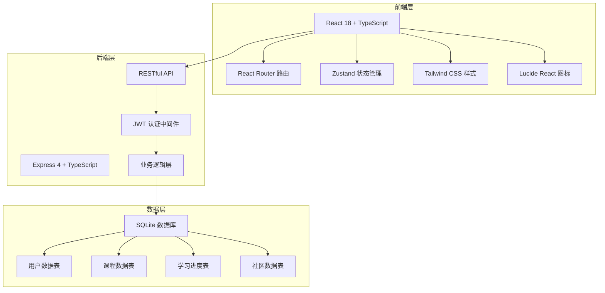
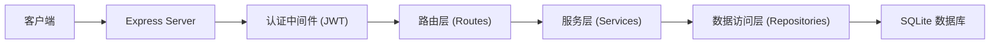
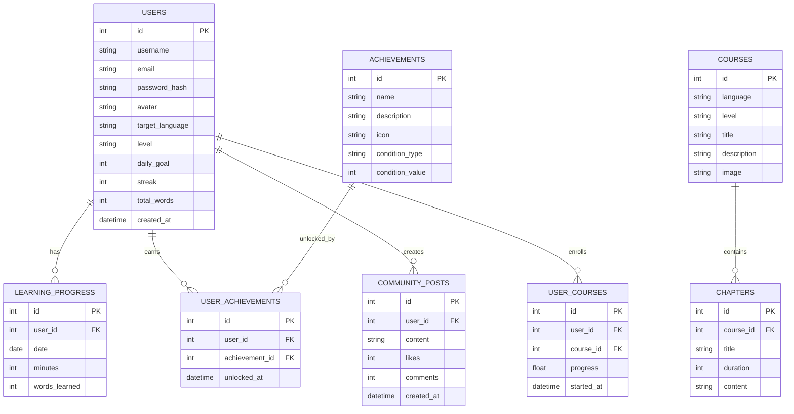

## 1. 架构设计



## 2. 技术描述

- **前端**：React 18 + TypeScript + Vite + Tailwind CSS 3 + Zustand + React Router DOM + Lucide React
- **后端**：Express 4 + TypeScript + JWT 认证
- **数据库**：SQLite（内嵌式，零配置，便于开发演示）
- **初始化工具**：vite-init (react-express-ts 模板)

## 3. 路由定义

### 前端路由
| 路由 | 页面 | 说明 |
|------|------|------|
| / | 首页 | 平台介绍、语言选择、特色功能 |
| /courses | 课程中心 | 分级课程列表、筛选 |
| /courses/:id | 课程详情 | 课程介绍、章节列表 |
| /learn/vocabulary | 单词记忆 | 单词卡片学习 |
| /learn/grammar | 语法练习 | 语法题目练习 |
| /learn/speaking | 口语跟读 | 句子跟读训练 |
| /learn/listening | 听力训练 | 听力材料练习 |
| /progress | 学习中心 | 进度仪表盘、统计数据 |
| /community | 社区广场 | 动态流、排行榜 |
| /login | 登录页 | 用户登录 |
| /register | 注册页 | 用户注册 |
| /profile | 个人中心 | 个人信息、学习路径 |

### 后端 API 路由
| 路由 | 方法 | 说明 |
|------|------|------|
| /api/auth/register | POST | 用户注册 |
| /api/auth/login | POST | 用户登录 |
| /api/auth/profile | GET | 获取用户信息 |
| /api/auth/profile | PUT | 更新用户信息 |
| /api/courses | GET | 获取课程列表 |
| /api/courses/:id | GET | 获取课程详情 |
| /api/progress | GET | 获取学习进度 |
| /api/progress | POST | 更新学习进度 |
| /api/vocabulary | GET | 获取单词列表 |
| /api/grammar | GET | 获取语法题目 |
| /api/community/posts | GET | 获取社区动态 |
| /api/community/posts | POST | 发布动态 |
| /api/achievements | GET | 获取成就列表 |

## 4. API 定义

### TypeScript 类型定义

```typescript
// 用户
interface User {
  id: number;
  username: string;
  email: string;
  avatar: string;
  targetLanguage: 'en' | 'ja' | 'ko';
  level: 'beginner' | 'intermediate' | 'advanced';
  dailyGoal: number;
  streak: number;
  totalWords: number;
  createdAt: string;
}

// 课程
interface Course {
  id: number;
  language: string;
  level: string;
  title: string;
  description: string;
  chapters: Chapter[];
  progress: number;
  image: string;
}

interface Chapter {
  id: number;
  title: string;
  duration: number;
  completed: boolean;
}

// 单词
interface Word {
  id: number;
  word: string;
  meaning: string;
  pronunciation: string;
  example: string;
  exampleTranslation: string;
}

// 语法题
interface GrammarQuestion {
  id: number;
  question: string;
  options: string[];
  correctAnswer: number;
  explanation: string;
}

// 学习进度
interface LearningProgress {
  totalMinutes: number;
  todayMinutes: number;
  wordsLearned: number;
  streak: number;
  completedCourses: number;
  achievements: Achievement[];
}

// 成就
interface Achievement {
  id: number;
  name: string;
  description: string;
  icon: string;
  unlocked: boolean;
  unlockedAt?: string;
}

// 社区动态
interface CommunityPost {
  id: number;
  userId: number;
  username: string;
  avatar: string;
  content: string;
  likes: number;
  comments: number;
  createdAt: string;
}
```

## 5. 服务器架构图



## 6. 数据模型

### 6.1 数据模型定义



### 6.2 初始化数据

- 用户表：预置 3 个演示用户
- 课程表：英语/日语/韩语各 3 个级别课程
- 单词表：每种语言 50+ 常用单词
- 语法题：每种语言 20+ 语法练习题
- 成就表：10+ 个成就徽章
- 社区动态：预置若干演示动态